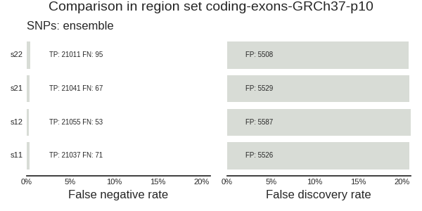
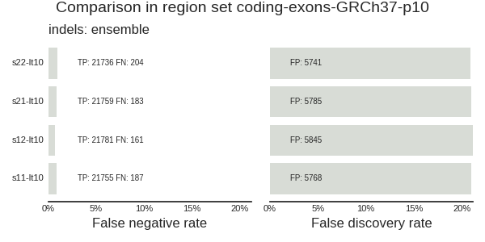
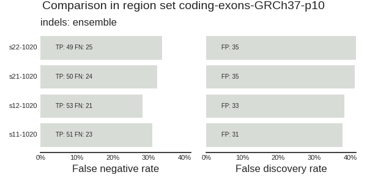
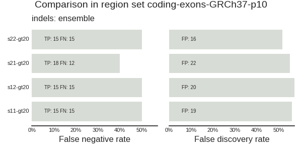

Validation procedure
======================

.. toctree::
   :maxdepth: 2

This folder contains a few shell scripts to validate variant calls of NA12878 samples s11, s12, s21, s22 in *vcf* files obtained by bcbio-nextgen whole exome sequencing (WES) bioinformatics pipeline. The validation algorithm and sripts described here are very general. They can be applied to the NA12878 variant calls obtained by any pipeline. The validation algorithm and scripts are based on Real Time Genomics (RTG) *vcfeval* program and its format of reporting. A procedure of obtaining exon regions which constrain a scope of validation is also highlighted. 

Validation overview
--------------------
Validation of bioinformatics pipeline comprises comparison of experimental calls to the high confidence reference calls. The comparison entails three levels - matching genomic positions, matching identities of the calls and matching genotypes. Such comparison produces several validation metrics:

   True Positives  (TP): 
      Experimental calls matching reference calls by position, identity and genotype. 

   False Negatives (FN):
      Variants that are present in the reference, but are not called by the pipeline.

   False Positives (FP):
      Variants that were called by the pipeline but either are not present in the reference or have a different identity/genotype.

   Sensitivity: 
      Sens = TP/(TP+FN)

   False Negative Rate: 
      FNR  = FN/(TP+FN)

   False Positive Rate:
      FPR  = FP/(TP+FN)

In genomic calls validation it is not possible to have many positions that are high confidence homozygous reference. The regions in which `homozygous reference information is available <https://www.ncbi.nlm.nih.gov/variation/tools/get-rm/>`_ comprise a small part of the genome and therefore are informative only locally. 

Sensitivity metrics represents analytical sensitivity and for a clinical test it is desirable to have 100% analytical sensitivity. False negatives usually are characterized by low coverage or being in a difficult or high homology region. The number of False Positives can be inflated, because the reference materials contain only high confidence calls and do not account for the calls in the reference that may be true variants which have lower confidence. The False Positives have to be verified in `NCBI GET-RM Browser <https://www.ncbi.nlm.nih.gov/variation/tools/get-rm/browse/>`_. Another False Positive source represents calls that differ from the reference calls in identity or genotype. Perhaps these calls should be used to estimate the False Positive Rate (FPR). 

The genomic variant calls consist of single nucleotide variants and insertions and deletions (Indels) of various sizes. In validation the Indels are stratified by their size: 

   * less or equal 10bp     (variant length <= 10bp)
   * in between 10 and 20bp (10bp < variant length <= 20bp)
   * in between 20 and 30bp (20bp < variant length <= 30bp)
   * more that 30bp         (variant length > 30bp)

.. NOTE::
   Comparison between the experimental and reference calls is performed and validation metrics are computed only in the restricted genomic regions of interest. 

Software: Real Time Genomics(RTG) *rtg-tools vcfeval*
-------------------------------------------------------

There are several options of the `standard software tools <https://github.com/ga4gh/benchmarking-tools/tree/master/tools>`_ to validate variant calls against the reference which is recommended by Global Alliance for Genomics and Health. One such tool is Real Time Genomics `*rtg-tools* <https://github.com/RealTimeGenomics/rtg-tools>`_. The function that was used in validation is *vcfeval*. The *rtg-tools* installation is described in its github page. Here it is described how the *vcfeval* function was used to validate experimental NA12878 calls. Similar procedure, only with different parameters can be used to compare any two sets of variant calls with each other.  

The experimental variant calls were obtained by the laboratory WES bioinformatics analysis bcbio-nextgen pipeline. The pipeline description and calls generation process can be found in Analysis section `The bcbio-nextgen pipeline`. It was determined that the most accurate calls are produced by the ensemble algorithm. The ensemble algorithm aggregates decisions of four callers - gatk haplotype, platypus, freebayes and samtools. If at least two callers called a variant, then this variant is included into results. The the four NA12878 samples are named as s11, s12 (Validation run 1 samples) and s21, s22 ( Validation run 2 samples). The two validation runs were performed at different times. The calls computed by *bcbio-nextgen* are in gzipped VCF format. 

Once *rtg-tools* are installed we can call *vcfeval*. It requires several parameters: 

   * experimental call sets       (s11.vcf.gz, ..., s22.vcf.gz)
   * reference    call set        (Giab-NA12878-latest.vcf.gz)
   * genomic regions of interest  (exons-touching-capture-minus-utr-pm10.bed) 
   * metrics to compute ROC       (variant quality QUAL or coverage depth DP)

The following listing contains a script *vcfeval.sh* calling *vcfeval*::

     1	#!/bin/bash
     2	# Compare experimental calls with reference
     3	#
     4	#Call : sh vcfeval.sh vcflist_containing_full_paths_to_vcf.gz_files output_dir_prefix vcf_field_for_ROC_threshold path_to_the_regions_bed_file
     5	#
     6	#Example:
     7	#       sh vcfeval.sh vcflist output_dir_prefix  QUAL  coding-exons.bed
     8	#
     9	# To use the script the RTG tools should be installed
    10	# RTG install :  https://github.com/RealTimeGenomics/rtg-tools
    11	
    12	# Set the correct paths to the parameters that will not be changing
    13	# RTGPATH=/path/to/rtg/program/folder
    14	
    15	RTGPATH=/home/erinija/Software/rtg-tools/rtg-tools-3.8.4-bdba5ea
    16	
    17	# REFSDF=/path/bcbio/genomes/sdf
    18	REFSDF=/media/erinija/data/bcbio/upgrade/genomes/Hsapiens/GRCh37/rtg/GRCh37.sdf
    19	
    20	#EVALREGIONS=/regions/within/which/comparison/should/be/performed
    21	# Genome in the bottle  high confidence regions and high confidence calls 
    22	# can be used to restrict comparison to only high confidence regions.
    23	# These should be provided with the parameter --evaluation-regions=/path/to/the/bed/file
    24	#
    25	# This command dowloads the high confidence Sanger validated NA12878 genomic regions from NCBI GET-RM
    26	# wget ftp://ftp.ncbi.nlm.nih.gov/variation/get-rm/current/NA12878_sanger_validated.bed.gz
    27	#
    28	# This command downloads high confidence NA12878 variant calls from NCGI GET-RM
    29	# wget ftp://ftp.ncbi.nlm.nih.gov/variation/get-rm/current/variant_calls/NA12878/NIST/converted_NIST_NA12878_GIAB_V_2_18_High_Confidence_SNPs_Indels.vcf.gz
    30	# 
    31	# Other regions within which a comparison should be restricted
    32	# such as capture should be provided  with the parameter
    33	# --bed-regions=/path/to/capture/regions
    34	# Note, that seq names in regions in the bed file should be consistent with the 
    35	# seq names in the vcf  and genome build (GRCh37 instead of chrNum has only Num, so the bed line looks like : Num start	stop)
    36	# 
    37	# BEDREGIONS will be passed as a parameter to this script 
    38	# BEDREGIONS=/path/to/bed/regions
    39	
    40	
    41	# REFCALLS=/ path/to/reference/calls  it can be also another vcf file taken as a  reference base
    42	REFCALLS=/media/erinija/data/Databases/GIAB/NA12878-latest/HG001_GRCh37_GIAB_highconf_CG-IllFB-IllGATKHC-Ion-10X-SOLID_CHROM1-X_v.3.3.2_highconf_PGandRTGphasetransfer.vcf.gz
    43	# 
    44	# Reference calls NA12878_high_quality_variant.vcf.gz  from NCBI GET-RM website are in multisample call format and vcfeval does not work with this format 
    45	
    46	# Provide a list of  *.vcf.gz files as a parameter
    47	# vcf files are already bgzipped an indexed with tabix (such as they are created in bcbio final)
    48	
    49	VCFLIST=$1
    50	OUTDIRPREFIX=$2
    51	VCFFIELD=$3
    52	BEDREGIONS=$4
    53	
    54	for vcf in `cat ${VCFLIST}`
    55	do
    56	
    57	# strip the name
    58	bname=`basename ${vcf} .vcf.gz`
    59	OUTPUTDIR=${OUTDIRPREFIX}-${bname}
    60	
    61	# check if the directory exists, if it does remove, because rtg generates an error if it exists
    62	if [ -d $OUTPUTDIR ] 
    63	then
    64		rm -f -r ${OUTPUTDIR}
    65	fi
    66	
    67	echo ${vcf}
    68	echo ${OUTPUTDIR}
    69	
    70	${RTGPATH}/rtg vcfeval --bed-regions=${BEDREGIONS} --all-records --vcf-score-field=${VCFFIELD} -b ${REFCALLS} -c ${vcf} --output=${OUTPUTDIR} -t ${REFSDF}                                     
    71	
    72	# If needed, call vcfeval with evaluation regions
    73	#${RTGPATH}/rtg vcfeval --evaluation-regions=${EVALREGIONS} --all-records --vcf-score-field=${VCFFIELD} -b ${REFCALLS} -c ${vcf} --output=${OUTPUTDIR} -t ${REFSDF}
    74	
    75	
    76	done
    77	
    78	# Create  ROC plots  (if no -png is provided,  it opens interactive plot)
    79	# ${RTGPATH}/rtg rocplot ${OUTDIRPREFIX}*/weighted_roc.tsv.gz --png="roc.png" --line=width=2 --title=${VCFLIST}
    80	
    81	# Erinija Pranckeviciene, CHEO, 2018.03.07

In this script there is a parameter *REFSDF* which has to point to a reference genome in the SDF format of RTG. The *bcbio-nextgen* installation provides the reference for GRCh37 in SDF format. Otherwise, if not using the *bcbio-nextgen* one has to generate this file using the *rtg* commands. The Line #7 in the script shows an example of the call. The stable paths  are initialized inside the script. The parameters to the script are defined in Lines #49-52. The commented line #79 executed in command line opens interactive Receiver Operating Curve plot in which the calls of different samples can be compared. 

Running *vcfeval.sh* requires the file that provides a list of VCF files that need to be compared with reference Giab calls. The following is a scenario to perform validation with vcfeval.sh. In your working dir create a *validation-dir* and copy to it the vcf files that are being validated. The contents of the *validation-dir* is::

   $cd validation-dir
   $ls
   ss11.vcf.gz  s11.vcf.gz.tbi  s12.vcf.gz  s12.vcf.gz.tbi  s21.vcf.gz  s21.vcf.gz.tbi  s22.vcf.gz  s22.vcf.gz.tbi vcflist 
   $cat vcflist
   s11.vcf.gz 
   s12.vcf.gz 
   s21.vcf.gz 
   s22.vcf.gz

The *vcf.gz* files all might be in different locations. Then the vcflist file has to contain a list of to be processed *vcf.gz* files with the absolute paths such as for example */home/bcbio-project/validationrun1/sample1/final/sample1.vcf.gz*. The path to the latest release of Giab reference calls does not change and it is specified in the line #42 of vcfeval.sh script. For the VCFFIELD parameter we will use variant call quality QUAL. The OUTDIRPREFIX prefix will be coding-exons-GRCh37-p10. This prefix tells which regions *bed* file is used to restrict calls comparisons. For each sample *vcf.gz* a separate directory will be created to keep validation results. The directories will have names *OUTDIRPREFIX-sample*. The coding exons were obtained from UCSC Genome Table browser::

   $head ../regions/coding-exons.bed 
   chr1	67000041	67000051	NM_001308203.1_cds_1_0_chr1_67000042_f	0	+
   chr1	67091529	67091593	NM_001308203.1_cds_2_0_chr1_67091530_f	0	+
   chr1	67098752	67098777	NM_001308203.1_cds_3_0_chr1_67098753_f	0	+
   chr1	67105459	67105516	NM_001308203.1_cds_4_0_chr1_67105460_f	0	+
   chr1	67108492	67108547	NM_001308203.1_cds_5_0_chr1_67108493_f	0	+

We have to select only those exons that have a common area with Agilent-CREv2 regions. To select these exons the `*bedtools intersect* <https://bedtools.readthedocs.io/en/latest/content/tools/intersect.html>`_ was used as follows:: 

   $bedtools intersect -wa -a ../regions/coding-exons.bed -b ../regions/Agilent-CREv2.bed | sed 's/chr//' >  ../regions/coding-exons-intersect-capture-GRCh37-names.bed
   $head  ../regions/coding-exons-intersect-capture-GRCh37-names.bed
   1	67000041	67000051	NM_001308203.1_cds_1_0_chr1_67000042_f	0	+
   1	67091529	67091593	NM_001308203.1_cds_2_0_chr1_67091530_f	0	+
   1	67098752	67098777	NM_001308203.1_cds_3_0_chr1_67098753_f	0	+
   1	67105459	67105516	NM_001308203.1_cds_4_0_chr1_67105460_f	0	+
   1	67108492	67108547	NM_001308203.1_cds_5_0_chr1_67108493_f	0	+

The *sed* is used to remove `chr` from the chromosome name to make it compatible with GRCh37 chromosome naming. We need to add 10bp flanks to each coding exon region. We use `*bedtools slop* <https://bedtools.readthedocs.io/en/latest/content/tools/slop.html>`_ . The slop command needs a two column file with chromosome sizes::

   $head ../regions/genomeGRCh37.chrsizes
   1	249250621
   2	243199373
   3	198022430
   4	191154276
   5	180915260

Calling *bedtools slop* extends coding exons regions by 10 base pairs at each end:: 

   $bedtools slop -b 10 -g ../regions/genomeGRCh37.chrsizes -i ../regions/coding-exons-intersect-capture-GRCh37-names.bed > ../regions/coding-exons-intersect-capture-GRCh37-names-p10.bed
   $head ../regions/coding-exons-intersect-capture-GRCh37-names-p10.bed
   1	67000031	67000061	NM_001308203.1_cds_1_0_chr1_67000042_f	0	+
   1	67091519	67091603	NM_001308203.1_cds_2_0_chr1_67091530_f	0	+
   1	67098742	67098787	NM_001308203.1_cds_3_0_chr1_67098753_f	0	+
   1	67105449	67105526	NM_001308203.1_cds_4_0_chr1_67105460_f	0	+
   1	67108482	67108557	NM_001308203.1_cds_5_0_chr1_67108493_f	0	+

Now we can call vcfeval.sh providing it regions of extended coding exons. The *rtg vcfeval* expects that the *tabix* indexes of *vcf.gz* files are provided in the same directory. The call shown below produces the following output:: 
   
   $sh ../shell-scripts/vcfeval.sh vcflist coding-exons-GRCh37-p10 QUAL ../regions/coding-exons-intersect-capture-GRCh37-names-p10.bed
   s11.vcf.gz
   coding-exons-GRCh37-p10-s11
   Reference sequence Y is used in calls but not in baseline.
   Threshold  True-pos-baseline  True-pos-call  False-pos  False-neg  Precision  Sensitivity  F-measure
   ----------------------------------------------------------------------------------------------------
     228.800              21291          21292       4667        754     0.8202       0.9658     0.8871
        None              21820          21821       5818        225     0.7895       0.9898     0.8784
   
   s12.vcf.gz
   coding-exons-GRCh37-p10-s12
   Reference sequence Y is used in calls but not in baseline.
   Threshold  True-pos-baseline  True-pos-call  False-pos  False-neg  Precision  Sensitivity  F-measure
   ----------------------------------------------------------------------------------------------------
     230.800              21608          21609       4793        437     0.8185       0.9802     0.8920
        None              21848          21849       5898        197     0.7874       0.9911     0.8776
   
   s21.vcf.gz
   coding-exons-GRCh37-p10-s21
   Reference sequence Y is used in calls but not in baseline.
   Threshold  True-pos-baseline  True-pos-call  False-pos  False-neg  Precision  Sensitivity  F-measure
   ----------------------------------------------------------------------------------------------------
     228.700              21485          21486       4713        560     0.8201       0.9746     0.8907
        None              21826          21827       5842        219     0.7889       0.9901     0.8781
   
   s22.vcf.gz
   coding-exons-GRCh37-p10-s22
   Reference sequence Y is used in calls but not in baseline.
   Threshold  True-pos-baseline  True-pos-call  False-pos  False-neg  Precision  Sensitivity  F-measure
   ----------------------------------------------------------------------------------------------------
     228.700              21311          21309       4634        734     0.8214       0.9667     0.8881
        None              21801          21800       5792        244     0.7901       0.9889     0.8784

The results for each sample are in the corresponding directory prefixed by *coding-exons-GRCh37-p10*. Listing one level deeper shows the contents of each directory in which we find files named by **tp, fp, fn**. These files contain true positive, false negative and false positive calls::

   $ls
   coding-exons-GRCh37-p10-s11  coding-exons-GRCh37-p10-s21  s11.vcf.gz      s12.vcf.gz      s21.vcf.gz      s22.vcf.gz      vcflist
   coding-exons-GRCh37-p10-s12  coding-exons-GRCh37-p10-s22  s11.vcf.gz.tbi  s12.vcf.gz.tbi  s21.vcf.gz.tbi  s22.vcf.gz.tbi
   $ ls */
   coding-exons-GRCh37-p10-s11/:
   done       fn.vcf.gz.tbi  fp.vcf.gz.tbi       phasing.txt  snp_roc.tsv.gz  tp-baseline.vcf.gz      tp.vcf.gz      vcfeval.log
   fn.vcf.gz  fp.vcf.gz      non_snp_roc.tsv.gz  progress     summary.txt     tp-baseline.vcf.gz.tbi  tp.vcf.gz.tbi  weighted_roc.tsv.gz
   
   coding-exons-GRCh37-p10-s12/:
   done       fn.vcf.gz.tbi  fp.vcf.gz.tbi       phasing.txt  snp_roc.tsv.gz  tp-baseline.vcf.gz      tp.vcf.gz      vcfeval.log
   fn.vcf.gz  fp.vcf.gz      non_snp_roc.tsv.gz  progress     summary.txt     tp-baseline.vcf.gz.tbi  tp.vcf.gz.tbi  weighted_roc.tsv.gz
   
   coding-exons-GRCh37-p10-s21/:
   done       fn.vcf.gz.tbi  fp.vcf.gz.tbi       phasing.txt  snp_roc.tsv.gz  tp-baseline.vcf.gz      tp.vcf.gz      vcfeval.log
   fn.vcf.gz  fp.vcf.gz      non_snp_roc.tsv.gz  progress     summary.txt     tp-baseline.vcf.gz.tbi  tp.vcf.gz.tbi  weighted_roc.tsv.gz   
   
   coding-exons-GRCh37-p10-s22/:
   done       fn.vcf.gz.tbi  fp.vcf.gz.tbi       phasing.txt  snp_roc.tsv.gz  tp-baseline.vcf.gz      tp.vcf.gz      vcfeval.log
   fn.vcf.gz  fp.vcf.gz      non_snp_roc.tsv.gz  progress     summary.txt     tp-baseline.vcf.gz.tbi  tp.vcf.gz.tbi  weighted_roc.tsv.gz

.. NOTE:: 
   The same workflow can be used to compare any *vcf* files within any genomic regions given in *bed* file. 

To further analyze results of validation and compute Sensitivity and other metrics we need to extract relevant information from resulting **tp,fn,fp** files.

Custom scripts to represent validation results
-----------------------------------------------

To compute sensitivity and other metrics the counts of **tp,fn,fp** have to be extracted from the *vcf* files and summarized for each variant type. The script below summarizes true positives, false negatives and false positives for the analysis results obtained in previus sections. The SNP and indel variants are treated separately. The indels are stratified by their length into three categories - shorter than 10 bp, in between of 10 and 20 bp and longer than 20bp::

     1	#!/usr/bin/sh
     2	# Script to summarize validation results of vcfeval
     3	
     4	if test "$#" -ne 2 ; then
     5	echo " NAME"
     6	echo "   validation_summary.sh"
     7	echo ""
     8	echo " Provide a list of prefixes separated by space and  for each prefix a separate file will be created "
     9	echo " CALL "
    10	echo "    sh validation_summary.sh 'list-of-prefixes-to-folder-names' 'list-od-sample-names-prefixed-by-folder-prefix' " 
    11	echo ""
    12	echo " EXAMPLE"
    13	echo "    sh validation_summary.sh 'coding-exons-GRCh37-p10 some-other-regions' 's11 s12 s21 s22' " 
    14	echo ""
    15	echo " DESCRIPTION"
    16	echo "Script summarizes validation results generated vy rtg-tools vcfeval"
    17	echo "List of prefixes identifies regions, which are connected to the sample names by  the symbol -" 
    18	echo "The snp and indels are separated and indels are stratified by length"
    19	echo "Plotting python script and png graph of the results are  generated on the fly"
    20	
    21	    exit 1
    22	
    23	fi
    24	
    25	PREFIXES=$1 
    26	SAMPLES=$2
    27	
    28	for prefix in ${PREFIXES}
    29	do
    30	## the prefix  denotes regions for which statistics is generated
    31	echo "sample,caller,vtype,metric,value" > ${prefix}-snp.csv
    32	echo "sample,caller,vtype,metric,value" > ${prefix}-indels1.csv
    33	echo "sample,caller,vtype,metric,value" > ${prefix}-indels2.csv
    34	echo "sample,caller,vtype,metric,value" > ${prefix}-indels3.csv
    35	
    36	for sample in ${SAMPLES}
    37	do
    38	DIR=`pwd`"/${prefix}-${sample}"
    39	echo ${DIR}
    40	
    41	for status in tp fn fp
    42	do
    43	
    44	# True Positives tp fn an fp are in status variable
    45	
    46	      snp=`zcat ${DIR}/${status}.vcf.gz  | grep -v ^"#" | awk '{print length($4)+length($5) "\t" $0}'| awk '{ if ($1==2) print $0}' |  wc -l`
    47	      indel1=`zcat ${DIR}/${status}.vcf.gz | grep -v ^"#" | awk '{print length($4)+length($5) "\t" $0}'| awk '{ if ($1<11) print $0}' |  wc -l`
    48	      indel2=`zcat ${DIR}/${status}.vcf.gz | grep -v ^"#" | awk '{print length($4)+length($5) "\t" $0}'| awk '{ if ( ($1>=11) && ($1<21) ) print $0}' |  wc -l`
    49	      indel3=`zcat ${DIR}/${status}.vcf.gz | grep -v ^"#" | awk '{print length($4)+length($5) "\t" $0}'| awk '{ if ($1>=21) print $0}' |  wc -l`
    50	
    51	
    52	## Separate  snps and indels , separate indels by size 
    53	
    54	      echo ${sample},"ensemble",SNPs,${status},${snp}>> ${prefix}-snp.csv
    55	      echo ${sample}-lt10,"ensemble",indels,${status},${indel1} >> ${prefix}-indels1.csv
    56	      echo ${sample}-1020,"ensemble",indels,${status},${indel2}>> ${prefix}-indels2.csv
    57	      echo ${sample}-gt20,"ensemble",indels,${status},${indel3} >> ${prefix}-indels3.csv
    58	
    59	done # status
    60	
    61	done  #sample
    62	
    63	## visualize with python script
    64	## create a script on the fly 
    65	## this is for particular region prefix
    66	
    67	echo "import sys" > bcbio_validation_plot_${prefix}.py
    68	echo "from bcbio.variation import validateplot" >> bcbio_validation_plot_${prefix}.py
    69	echo "title='Comparison in region set ${prefix}'" >> bcbio_validation_plot_${prefix}.py
    70	echo "validateplot.classifyplot_from_valfile(sys.argv[1], outtype='png', title=title)" >> bcbio_validation_plot_${prefix}.py
    71	# plot snp
    72	/media/erinija/data/bcbio/local/share/bcbio/anaconda/bin/python bcbio_validation_plot_${prefix}.py ${prefix}-snp.csv
    73	#plot indels1
    74	/media/erinija/data/bcbio/local/share/bcbio/anaconda/bin/python bcbio_validation_plot_${prefix}.py ${prefix}-indels1.csv
    75	#plot indels2
    76	/media/erinija/data/bcbio/local/share/bcbio/anaconda/bin/python bcbio_validation_plot_${prefix}.py ${prefix}-indels2.csv
    77	#plot indels3
    78	/media/erinija/data/bcbio/local/share/bcbio/anaconda/bin/python bcbio_validation_plot_${prefix}.py ${prefix}-indels3.csv
    79	
    80	done  #prefix

The sript is called in a following way::

   sh ../shell-scripts/validation_summary.sh  'coding-exons-GRCh37-p10' 's11 s12 s21 s22'

It creates the *csv* files containg summary of **tp,fn,fp** for each variant type and automatically generates a plotting script and corresponding plots, shown below. Information in *csv* file is written as follows::

   $head -n3 *.csv
   ==> coding-exons-GRCh37-p10-indels1.csv <==
   sample,caller,vtype,metric,value
   s11-lt10,ensemble,indels,tp,21755
   s11-lt10,ensemble,indels,fp,5768
   
   ==> coding-exons-GRCh37-p10-indels2.csv <==
   sample,caller,vtype,metric,value
   s11-1020,ensemble,indels,tp,51
   s11-1020,ensemble,indels,fp,31
   
   ==> coding-exons-GRCh37-p10-indels3.csv <==
   sample,caller,vtype,metric,value
   s11-gt20,ensemble,indels,tp,15
   s11-gt20,ensemble,indels,fp,19 
   
   ==> coding-exons-GRCh37-p10-indels.csv <==
   sample,caller,vtype,metric,value
   s11-lt10,ensembleindels,tp,21755
   s11-g10l20,ensembleindels,tp,51
   
   ==> coding-exons-GRCh37-p10-snp.csv <==
   sample,caller,vtype,metric,value
   s11,ensemble,SNPs,tp,21037
   s11,ensemble,SNPs,fp,5526

These files are visualized by the python script created in the fly. 

    Summary of validation results for SNP.

    Summary of validation results for INDELS less than 10bp.

    Summary of validation results for INDELS in between 10 and 20 bp.

    Summary of validation results for INDELS longer than 20bp.

Next we will need to investigate the false negatives (FN) and false positives (FP). 

Obtaining lists of false negatives and false positives
--------------------------------------------------------

To analyze the false negatives and positives reported br *vcfeval* we need to make an aggregated list. A fillowing script does that::

     1	#!/usr/bin/sh
     2	# Script to summarize validation results of vcfeval
     3	
     4	if test "$#" -ne 2 ; then
     5	echo " NAME"
     6	echo "   list-fn-and-fp.sh"
     7	echo ""
     8	echo " CALL "
     9	echo "    sh list-fn-and-fp.sh 'list-of-prefixes-to-folder-names' 'list-of-sample-names-prefixed-by-folder-prefix' " 
    10	echo ""
    11	echo " EXAMPLE"
    12	echo "    sh validation_summary.sh 'coding-exons-GRCh37-p10 some-other-regions' 's11 s12 s21 s22' " 
    13	echo ""
    14	echo " DESCRIPTION"
    15	echo "Script creates a list of false negatives and false positives aggregating results from all samples "
    16	echo "prefixed by the same prefix. The snp and indels are separated and indels are stratified by length."
    17	
    18	    exit 1
    19	
    20	fi
    21	
    22	PREFIXES=$1 
    23	SAMPLES=$2
    24	
    25	for prefix in ${PREFIXES}
    26	do
    27	
    28	for status in fn fp
    29	do
    30	
    31	SNPFILE=`pwd`/${status}-${prefix}-snp
    32	INDEL1FILE=`pwd`/${status}-${prefix}-indel
    33	#INDEL2FILE=`pwd`/${status}-${prefix}-indel2
    34	#INDEL3FILE=`pwd`/${status}-${prefix}-indel3
    35	
    36	> $SNPFILE
    37	
    38	head $SNPFILE
    39	
    40	
    41	for sample in ${SAMPLES}
    42	do
    43	
    44	DIR=`pwd`"/${prefix}-${sample}"
    45	echo ${DIR}
    46	
    47	
    48	# True Positives tp fn an fp are in status variable
    49	
    50	      zcat ${DIR}/${status}.vcf.gz  | grep -v ^"#" | awk '{print length($4)+length($5) "\t" $0}'| awk '{ if ($1==2) print $0}'| cut -f2-11  >> ${SNPFILE}
    51	      zcat ${DIR}/${status}.vcf.gz  | grep -v ^"#" | awk '{print length($4)+length($5) "\t" $0}'| awk '{ if ($1>2) print $0}'| cut -f2-11  >> ${INDEL1FILE}
    52	
    53	#      indel1=`zcat ${DIR}/${status}.vcf.gz | grep -v ^"#" | awk '{print length($4)+length($5) "\t" $0}'| awk '{ if ($1<11) print $0}' |  wc -l`
    54	#      indel2=`zcat ${DIR}/${status}.vcf.gz | grep -v ^"#" | awk '{print length($4)+length($5) "\t" $0}'| awk '{ if ( ($1>=11) && ($1<21) ) print $0}' |  wc -l`
    55	#      indel3=`zcat ${DIR}/${status}.vcf.gz | grep -v ^"#" | awk '{print length($4)+length($5) "\t" $0}'| awk '{ if ($1>=21) print $0}' |  wc -l`
    56	
    57	done # sample
    58	
    59	cat ${SNPFILE} | sort -k1,1n -k2,2 | uniq -c | sort -k1,1nr | awk '{print "chr"$2":"$3-20"-"$3+20 "\t" $0}' | grep difficult > ${SNPFILE}.difficult
    60	cat ${SNPFILE} | sort -k1,1n -k2,2 | uniq -c | sort -k1,1nr | awk '{print "chr"$2":"$3-20"-"$3+20 "\t" $0}' | grep -v difficult > ${SNPFILE}.notdifficult
    61	cat $SNPFILE.notdifficult  | awk '{print $0 "\t" "notdifficult" }' > ${SNPFILE}.csv 
    62	cat $SNPFILE.difficult  | awk '{print $0 "\t" "difficult" }' >> ${SNPFILE}.csv 
    63	
    64	cat ${INDEL1FILE} | sort -k1,1n -k2,2 | uniq -c | sort -k1,1nr | awk '{print "chr"$2":"$3-20"-"$3+20 "\t" $0}' | grep difficult > ${INDEL1FILE}.difficult
    65	cat ${INDEL1FILE} | sort -k1,1n -k2,2 | uniq -c | sort -k1,1nr | awk '{print "chr"$2":"$3-20"-"$3+20 "\t" $0}' | grep -v difficult > ${INDEL1FILE}.notdifficult
    66	cat ${INDEL1FILE}.notdifficult  | awk '{print $0 "\t" "notdifficult" }' > ${INDEL1FILE}.csv 
    67	cat ${INDEL1FILE}.difficult  | awk '{print $0 "\t" "difficult" }' >> ${INDEL1FILE}.csv 
    68	
    69	rm ${SNPFILE} ${INDEL1FILE} *.difficult  *.notdifficult
    70	
    71	done  # status
    72	
    73	done  #prefix

Two parameters are required - a list of prefixes and a list of sample names. The call to the script::

   sh ../shell-scripts/list-fn-and-fp.sh  'coding-exons-GRCh37-p10' 's11 s12 s21 s22'

Produces two output *csv* files for false negatives and false positives - one for single nucleotide variants and another for indels. The first column in the files is a location of the position printed in a format suitable to test it in a genome browser (UCSC or IGV), the second column contains number of samples in which this variant was a false negative, the third is a chromosome, the fourth is a position of the variant and all the following columns are from the Giab *vcf* , only the last column indicates whether the variant was in a difficult region or not (notdifficult and difficult) ::

   $head -n3 fn-coding-exons-GRCh37-p10-snp.csv 
   chr1:248084834-248084874	      4 1	248084854	rs4584426	A	G	50 PASS    platforms=2;platformnames=Illumina,10X;datasets=2;datasetnames=HiSeqPE300x,10XChromium;callsets=3;callsetnames=HiSeqPE300xGATK,HiSeqPE300xfreebayes,10XGATKhaplo;datasetsmissingcall=CGnormal,IonExome,SolidPE50x50bp,SolidSE75bp;callable=CS_HiSeqPE300xGATK_callable,CS_HiSeqPE300xfreebayes_callable;filt=CS_HiSeqPE300xGATK_filt	GT:DP:ADALL:AD:GQ:IGT:IPS:PS	1|1:317:4,153:0,0:198:1|1:HOMVAR:PATMAT	notdifficult
   chr1:248084889-248084929	      4 1	248084909	rs34508376	T	G	50	PASS platforms=2;platformnames=Illumina,10X;datasets=2;datasetnames=HiSeqPE300x,10XChromium;callsets=3;callsetnames=HiSeqPE300xGATK,HiSeqPE300xfreebayes,10XGATKhaplo;datasetsmissingcall=CGnormal,IonExome,SolidPE50x50bp,SolidSE75bp;callable=CS_HiSeqPE300xGATK_callable,CS_HiSeqPE300xfreebayes_callable;filt=CS_HiSeqPE300xGATK_filt	GT:DP:ADALL:AD:GQ:IGT:IPS:PS	1|1:348:5,166:0,0:198:1|1:HOMVAR:PATMAT	notdifficult
   chr12:9085432-9085472	      4 12	9085452	rs199938336	C	A	50	PASS   platforms=2;platformnames=Illumina,10X;datasets=2;datasetnames=HiSeqPE300x,10XChromium;callsets=3;callsetnames=HiSeqPE300xGATK,HiSeqPE300xfreebayes,10XGATKhaplo;datasetsmissingcall=CGnormal,IonExome,SolidPE50x50bp,SolidSE75bp;callable=CS_HiSeqPE300xGATK_callable,CS_HiSeqPE300xfreebayes_callable,CS_10XGATKhaplo_callable	GT:DP:ADALL:AD:GQ:IGT:IPS:PS	1|0:304:81,70:81,70:198:0/1:.:PATMAT	notdifficult
 
The false negative and false positive variants should be investigated further to explain the resons why they were deemed the false negatives and false positives. 

